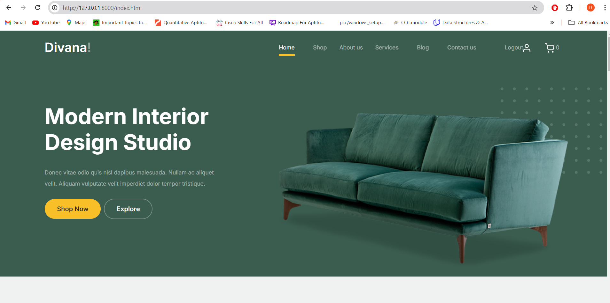
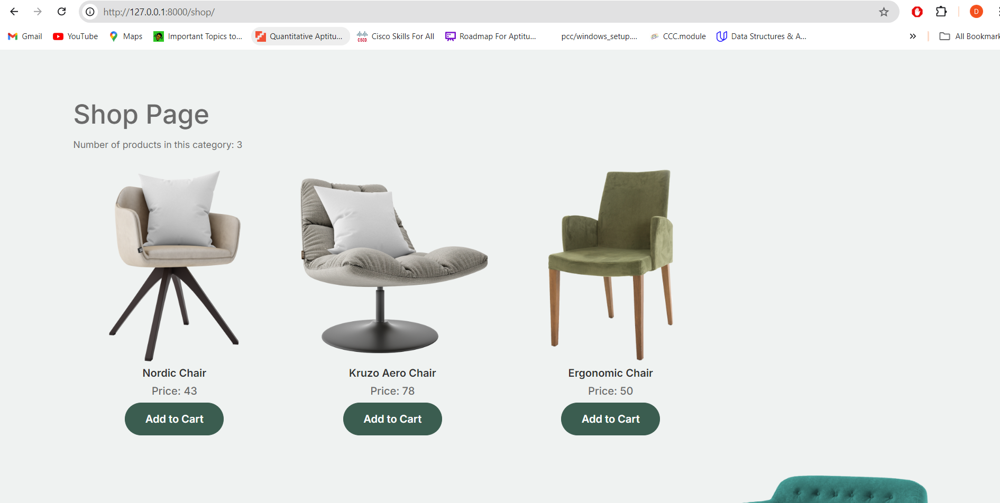

# Django eCommerce Platform
#Divana!

This is a fully functional eCommerce web application built using Django, allowing users to browse products, manage a shopping cart, and complete purchases.

## Features
- Product browsing with categories
- Shopping cart functionality
- User authentication (registration and login)
- Responsive design using Bootstrap
- Admin panel for product management (if implemented)

## Technologies Used
- **Backend**: Django
- **Database**: SQLite (or PostgreSQL)
- **Frontend**: HTML, CSS, JavaScript

## Prerequisites
Before you begin, ensure you have the following installed on your machine:
- [Python](https://www.python.org/downloads/) (3.6 or later)
- [pip](https://pip.pypa.io/en/stable/installation/)
- Django (installable via pip)

## Installation Steps
1. **Clone the repository**:
   ```bash
   git clone https://github.com/yourusername/your-repo-name.git
   cd your-repo-name

## Screenshots



## Payment Integration

This application includes payment functionality through **Paytm**. Users can securely make transactions using their Paytm wallets, allowing for seamless checkout experiences.

### Setup Instructions for Paytm

1. **Create a Paytm Developer Account:**
   - Go to the [Paytm Developer Portal](https://developer.paytm.com/) and sign up for an account.

2. **Obtain API Keys:**
   - After creating an account, obtain the Merchant ID and Merchant Key required for integration.

3. **Configure Settings:**
   - Add your Paytm credentials in your environment settings or configuration file.

4. **Testing Transactions:**
   - Use the test credentials provided by Paytm to simulate transactions before going live.

### Payment Flow

1. User selects products and proceeds to checkout.
2. The application redirects to the Paytm payment gateway.
3. User completes the payment.
4. Upon successful payment, the application verifies the transaction and updates the order status.

### Important Links
- [Paytm Developer Documentation](https://developer.paytm.com/docs/all-in-one-sdk/)

## Prerequisites
Before you begin, ensure you have the following installed on your machine:
- [Python](https://www.python.org/downloads/) (3.6 or later)
- [pip](https://pip.pypa.io/en/stable/installation/)
- Django (installable via pip)

## Installation Steps
1. **Clone the repository**:
   ```bash
   git clone https://github.com/yourusername/your-repo-name.git
   cd your-repo-name

## steps to run the website

1.**Create and activate a virtual environment**

python -m venv venv
# Activate on Windows
venv\Scripts\activate
# Activate on macOS/Linux
source venv/bin/activate

2.**Install required packages:**

pip install -r requirements.txt

3. **Setup DataBase**

python manage.py migrate


4.**Run The Progarm**

python manage.py runserver
Open your web browser and go to http://127.0.0.1:8000/

## License

This project is licensed under the MIT License.


## Contribution

Contributions are welcome! Feel free to submit a pull request or open an issue for suggestions or enhancements.

## Acknowledgments
- [Bootstrap](https://getbootstrap.com/) for the responsive design framework.
- [Django REST Framework](https://www.django-rest-framework.org/) for building APIs.


## Contact

For any inquiries, please reach out to [gudimetladeepak.g@gmail.com].


